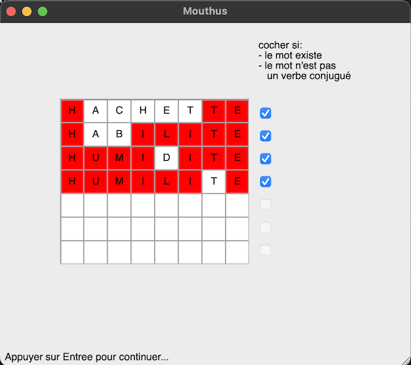

Mouthus
===

This project is a Qt project of a Motus game like. User can choose number of letter between 5 and 13. A word is randomly taken from a database built from lists retreived from (thank you) [LEXIQUE](http://lexique.org) website.

<p align="center">
  
</p>

It is based on Qt4 Core and GUI libraries.
It is composed of:
- a core part that can be used in a console application and
- a GUI part that implements a desktop graphical application on top of the core part

Build application
---

- Be sure Qt4 is installed on the system, on macOS, use [Homebrew](https://brew.sh):
```
# brew tap cartr/qt4
# brew install qt@4
# brew unlink qt && brew link qt@4
```
- Use CMake console application or GUI application,
```
# mkdir build && cd build
# cmake .. -DCMAKE_BUILD_TYPE=Release
# cmake --build .
```

> Developped in 2011, it still can be build and run on 2024!!!

Package application
---

- use CPack to package application (generates a .dmg on macOS)
```
# cpack
```